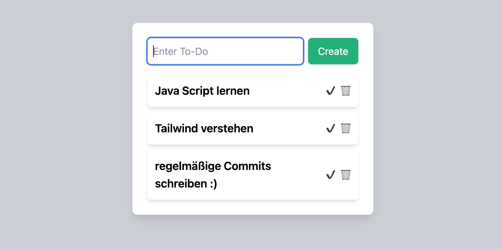

# 📝 To-Do Liste mit TailwindCSS

Dieses Projekt ist eine **einfache To-Do Liste**, die im Rahmen der **DCI** als Übung für DOM-Manipulation mit JavaScript erstellt wurde. Die Oberfläche wurde mit **TailwindCSS** gestaltet.

## ✨ Funktionen
- 📌 Aufgaben hinzufügen  
- ✅ Aufgaben als erledigt markieren  
- 🗑 Aufgaben löschen  
- 💡 Minimalistisches Design mit **TailwindCSS**

## 🚀 Technologien
- **HTML**
- **CSS (TailwindCSS)**
- **JavaScript (DOM-Manipulation)**

## 📸 Vorschau
